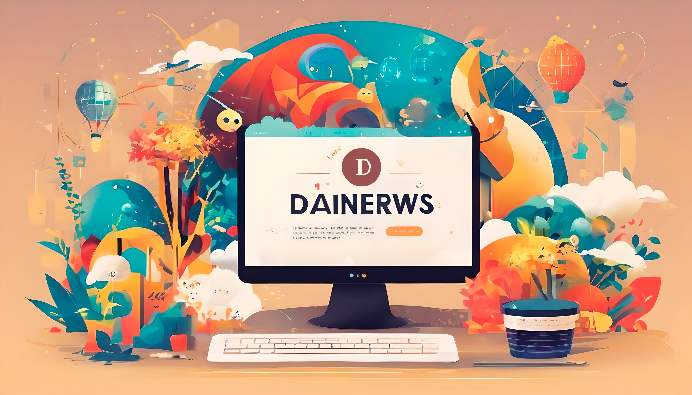

<h1>Hello, i'm Dainer Vargas </h1> 

 

Hello everyone! I am Dainer Manuel Vargas Jaraba, a lover
of web design. I have had notable achievements, such as
Regional Champion of La Guajira and represents my region
in Cúcuta.   Every day I continue to pursue excellence in web design, exploring new trends and techniques to provide unique and attractive solutions to my clients and audience. 

- 📫 How to reach me on Instagram: [@dainer_varggas](https://www.instagram.com/dainer_varggas/)

